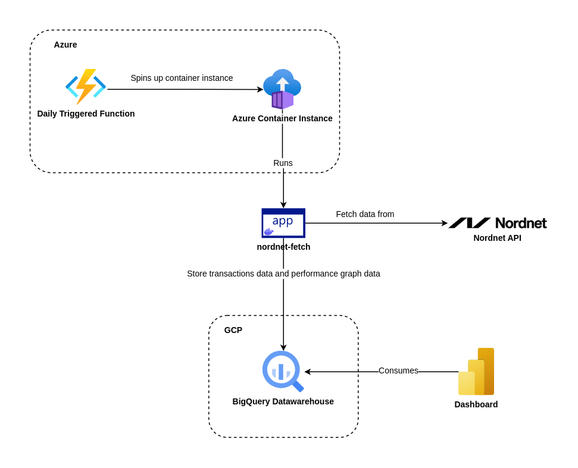

# <strong>Nordnet Fetch</strong>

Convience script to store my Nordnet transactions and performance graphs

## <strong>Overview</strong>



## <strong>Development Environment</strong>

### <strong>Requirements</strong>

-   Python 3+ (Developed in 3.11.0)

### <strong>Setup</strong>

#### <strong>Clone project</strong>

```console
$ git clone https://github.com/michaelbui99/nordnet-fetch.git
```

#### <strong>Create virtual environment</strong>

```console
$ cd ./nordnet-fetch
```

```console
$ python -m venv .venv
```

#### <strong>Activate virtual environment (windows)</strong>

```console
$ .\.venv\Scripts\activate
```

#### <strong>Activate virtual environment (linux)</strong>

```console
$ source ./.venv/bin/activate
```

#### <strong>Install dependencies</strong>

```console
$ pip install -r .\requirements.txt
```

#### <strong>GCP BigQuery</strong>

To store data to GCP BigQuery you need to setup a GPC Service Account key if running from container. The Service Account key should be placed at the project root as "gcp_service_key.json"

If you are only running locally you can just authenticate through gcloud

```console
$ gcloud init
```

#### <strong>Configuration</strong>

-   Rename .env.sample to .env
-   Fill out .env

```
NORDNET_USERNAME=myUsername123
NORDNET_PASSWORD=myPassword123
TRANSACTIONS_OUTPUT_PATH=PATH/TO/STORE/TRANSACTIONS/FILENAME
PERFORMANCE_GRAPH_OUTPUT_PATH=PATH/TO/STORE/PERFORMANCE_GRAPH_DATA/FILENAME
```

#### <strong>Build Image</strong>

The image stores sensitive data, so make your registry repository private

```console
$ docker build -t <DOCKER_HUB_USERNAME>/nordnet-fetch:latest .
```

## <strong>Run script</strong>

### <strong>Store files locally</strong>

```console
$ python ./src/main.py file
```

### <strong>Store data in BigQuery</strong>

TODO: Make project name and data set name configurable

```console
$ python ./src/main.py gcp
```
